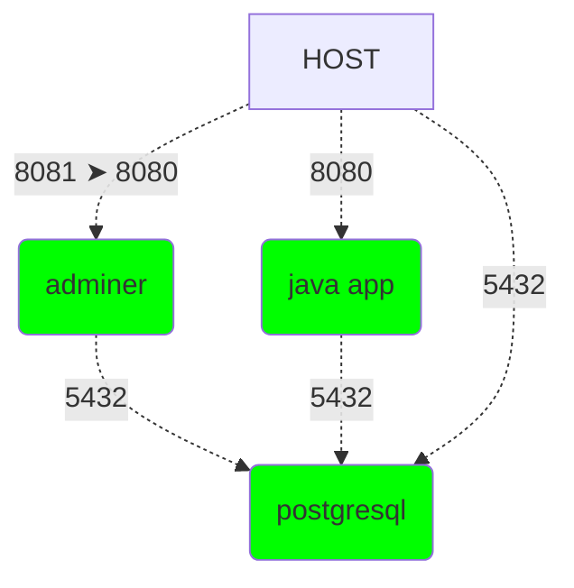

# docker-workshop

# Links utiles
- [podman](https://podman.io/) 
- [spring-graphql-2-jpa](https://github.com/Fradantim/spring-graphql-2-jpa)
- [spring-graphql-2-jpa localhost 8080](http://localhost:8080/graphiql)
- [postgresql driver](https://repo1.maven.org/maven2/org/postgresql/postgresql/42.7.3/postgresql-42.7.3.jar)

---

# Tabla de Contenidos
- [docker-workshop](#docker-workshop)
- [Links utiles](#links-utiles)
- [Tabla de Contenidos](#tabla-de-contenidos)
- [Hola mundo docker](#hola-mundo-docker)
- [Listar imagenes en mi sistema](#listar-imagenes-en-mi-sistema)
- [Creacion de imagen docker a partir de un compilado](#creacion-de-imagen-docker-a-partir-de-un-compilado)
- [Creacion de imagen docker a partir de código fuente](#creacion-de-imagen-docker-a-partir-de-código-fuente)
- [Ejecutar imagen docker](#ejecutar-imagen-docker)
  - [Exposición de puerto](#exposición-de-puerto)
- [Integracion](#integracion)
  - [Crear una red](#crear-una-red)
  - [Instanciar BBDD PostgreSQL](#instanciar-bbdd-postgresql)
  - [Instanciar adminer](#instanciar-adminer)
  - [Instanciar app con driver postgresql](#instanciar-app-con-driver-postgresql)
    - [Imagen sobrecargada](#imagen-sobrecargada)
    - [Instanciar container de imagen sobrecargada](#instanciar-container-de-imagen-sobrecargada)
    - [Capas de imagenes](#capas-de-imagenes)
  - [Diagrama](#diagrama)
  - [Apagar containers y borrar red](#apagar-containers-y-borrar-red)
  - [docker-compose](#docker-compose)
- [Montar recursos](#montar-recursos)
- [Logs de un container detachado](#logs-de-un-container-detachado)
- [Lanzar comandos shell](#lanzar-comandos-shell)
  - [En una imagen](#en-una-imagen)
  - [En  un container](#en--un-container)
- [Volumenes persistentes](#volumenes-persistentes)


---

# Hola mundo docker

```cmd
docker run --rm hello-world
```

# Listar imagenes en mi sistema
``` cmd
docker image ls
```
```
REPOSITORY      TAG       IMAGE ID       CREATED         SIZE
hello-world     latest    d2c94e258dcb   13 months ago   13.3kB
```

# Creacion de imagen docker a partir de un compilado
Preparo un archivo `Dockerfile-from-compilated-src`
```Dockerfile
# a partir de esta imagen base
FROM eclipse-temurin:21.0.3_9-jre-jammy
# descargo el .jar de la aplicacion
ADD https://github.com/Fradantim/spring-graphql-2-jpa/releases/download/8/graphql-2-jpa-8.jar .
# o si ya tengo el .jar en mi PC puedo:
# COPY graphql-2-jpa-8.jar .
RUN mv graphql-2-jpa-8.jar graphql-2-jpa.jar
# cuando inicie el container de esta imagen lanzar el siguiente comando
ENTRYPOINT ["java","-jar","graphql-2-jpa.jar"]
```

```cmd
docker build .
```
(referencia al archivo `Dockerfile`)

**Especificando Dockerfile**
```cmd
docker build -f Dockerfile-from-compilated-src .
```

**Especificando Dockerfile y tag (nombre imagen)**
```cmd
docker build -f Dockerfile-from-compilated-src -t graphql-2-jpa:from-compilated-src .
```

# Creacion de imagen docker a partir de código fuente
Preparo un archivo `Dockerfile-from-src`
```Dockerfile
# imagen constructora
# a partir de esta imagen base
FROM eclipse-temurin:21.0.3_9-jdk-jammy AS builder
# descargar el codigo fuente
RUN apt update && apt install git -y
RUN git clone https://github.com/Fradantim/spring-graphql-2-jpa.git --branch=8
RUN mv spring-graphql-2-jpa/* spring-graphql-2-jpa/.[!.]* .
# o si ya tengo el src en mi PC puedo:
# COPY graphql-2-jpa-8 .
# compilarlo
RUN sh mvnw clean package -DskipTests

# imagen final
# a partir de esta imagen base
FROM eclipse-temurin:21.0.3_9-jre-jammy
# copiar de la imagen builder el compilado y dejarlo en el directorio de trabajo de la imagen final
COPY --from=builder target/*.jar graphql-2-jpa.jar
ENTRYPOINT ["java","-jar","graphql-2-jpa.jar"]
```

```cmd
docker build -f Dockerfile-from-src -t graphql-2-jpa:from-src .
```

# Ejecutar imagen docker
```cmd
docker run --rm graphql-2-jpa:from-src
```

## Exposición de puerto
```cmd
docker run --rm -p 8080:8080 graphql-2-jpa:from-src
```

---

# Integracion


## Crear una red
```cmd
docker network create my-network
```
## Instanciar BBDD PostgreSQL
> info: https://hub.docker.com/_/postgres
```cmd
docker run --rm --network my-network --name my-postgresql-container -d -p 5432:5432 -e POSTGRES_USER=postgres -e POSTGRES_PASSWORD=postgres postgres:14.1-alpine
```
## Instanciar adminer
> info: https://hub.docker.com/_/adminer
```cmd
docker run --rm --network my-network -d -p 8081:8080 adminer:standalone
```
[adminer-frontend](http://localhost:8081)
- server: my-postgresql-container
- username: postgres
- password: postgres
- database: postgres

## Instanciar app con driver postgresql

### Imagen sobrecargada
Creo `Dockerfile-psql`

```Dockerfile
# a partir de esta imagen base
FROM graphql-2-jpa:from-src
# descargo driver postgresql
ADD https://repo1.maven.org/maven2/org/postgresql/postgresql/42.7.3/postgresql-42.7.3.jar .
# cuando inicie el container de esta imagen lanzar el siguiente comando
ENTRYPOINT ["java","-cp","graphql-2-jpa.jar:postgresql-42.7.3.jar", "org.springframework.boot.loader.launch.PropertiesLauncher"]
```

```cmd
docker build -f Dockerfile-psql -t graphql-2-jpa:psql .
```

### Instanciar container de imagen sobrecargada
```cmd
docker run --rm --network my-network -d -p 8080:8080 graphql-2-jpa:psql --spring.datasource.url=jdbc:postgresql://my-postgresql-container:5432/postgres --spring.datasource.username=postgres --spring.datasource.password=postgres
```

### Capas de imagenes
eclipse-temurin:21.0.3_9-jre-jammy -> graphql-2-jpa:from-src -> graphql-2-jpa:psql

```cmd
docker history graphql-2-jpa:psql
```

<table><colgroup width="85"></colgroup><colgroup width="382"></colgroup><colgroup width="85"></colgroup><colgroup width="382"></colgroup><tbody><tr><td></td><td><strong>IMAGEN</strong></td><td><strong>graphql-2-jpa:psql</strong></td><td></td><td></td></tr><tr><td>18</td><td>0B</td><td>ENTRYPOINT ["java" "-cp" "graphql-2-jpa.jar:…</td><td></td><td></td></tr><tr><td>17</td><td>1.09MB</td><td>ADD https://repo1.maven.org/maven2/org/postg…</td><td></td><td></td></tr><tr><td></td><td><strong>IMAGEN</strong></td><td><strong>graphql-2-jpa:from-src</strong></td><td></td><td></td></tr><tr><td>16</td><td>0B</td><td>ENTRYPOINT ["java" "-jar" "graphql-2-jpa.jar"]</td><td></td><td></td></tr><tr><td>15</td><td>53MB</td><td>COPY target/*.jar graphql-2-jpa.jar # buildkit</td><td></td><td></td></tr><tr><td></td><td><strong>IMAGEN</strong></td><td><strong><a href="https://hub.docker.com/layers/library/eclipse-temurin/21.0.3_9-jre-jammy/images/sha256-3186dd88a59659929855a6bb785b0528c812eb0b03d97fd6e2221526547ed322?context=explore">eclipse-temurin:21.0.3_9-jre-jammy</a></strong></td><td><strong>IMAGEN</strong></td><td><strong><a href="https://hub.docker.com/layers/library/eclipse-temurin/21.0.3_9-jdk-jammy/images/sha256-7291a4337ec7942c77490d4e44db3ec6d46cbef038b76108cec3949c0c06e550?context=explore">eclipse-temurin:21.0.3_9-jdk-jammy</a></strong></td></tr><tr><td>15</td><td></td><td></td><td>0B</td><td>CMD ["jshell"]</td></tr><tr><td>14</td><td>0B</td><td>ENTRYPOINT ["/__cacert_entrypoint.sh"]</td><td>0B</td><td>ENTRYPOINT ["/__cacert_entrypoint.sh"]</td></tr><tr><td>13</td><td>1.18kB</td><td>COPY entrypoint.sh /__cacert_entrypoint.sh #…</td><td>1.18kB</td><td>COPY entrypoint.sh /__cacert_entrypoint.sh #…</td></tr><tr><td>12</td><td>0B</td><td>RUN /bin/sh -c set -eux; echo "Verifying…</td><td>0B</td><td>RUN /bin/sh -c set -eux; echo "Verifying…</td></tr><tr><td>11</td><td>165MB</td><td>RUN /bin/sh -c set -eux; ARCH="$(dpkg --…</td><td>308MB</td><td>RUN /bin/sh -c set -eux; ARCH="$(dpkg --…</td></tr><tr><td>10</td><td>0B</td><td>ENV JAVA_VERSION=jdk-21.0.3+9</td><td>0B</td><td>ENV JAVA_VERSION=jdk-21.0.3+9</td></tr><tr><td>9</td><td>36.1MB</td><td>RUN /bin/sh -c set -eux; apt-get update;…</td><td>50MB</td><td>RUN /bin/sh -c set -eux; apt-get update;…</td></tr><tr><td>8</td><td>0B</td><td colspan="3">ENV LANG=en_US.UTF-8 LANGUAGE=en_US:en LC_AL…</td></tr><tr><td>7</td><td>0B</td><td colspan="3">ENV PATH=/opt/java/openjdk/bin:/usr/local/sb…</td></tr><tr><td>6</td><td>0B</td><td colspan="3">ENV JAVA_HOME=/opt/java/openjdk</td></tr><tr><td>5</td><td>0B</td><td colspan="3">/bin/sh -c #(nop) CMD ["/bin/bash"]</td></tr><tr><td>4</td><td>77.9MB</td><td colspan="3">/bin/sh -c #(nop) ADD file:89847d76d242dea90…</td></tr><tr><td>3</td><td>0B</td><td colspan="3">/bin/sh -c #(nop) LABEL org.opencontainers.…</td></tr><tr><td>2</td><td>0B</td><td colspan="3">/bin/sh -c #(nop) LABEL org.opencontainers.…</td></tr><tr><td>1</td><td>0B</td><td colspan="3">/bin/sh -c #(nop) ARG LAUNCHPAD_BUILD_ARCH</td></tr><tr><td>0</td><td>0B</td><td colspan="3">/bin/sh -c #(nop) ARG RELEASE</td></tr></tbody></table>

## Diagrama


## Apagar containers y borrar red
```cmd
docker container ls
```
Si hubiera omitido `--rm` en el `docker run` tendría algo como lo siguiente:
```
CONTAINER ID   IMAGE                  COMMAND                  CREATED             STATUS             PORTS                                       NAMES
f254b48e41d6   graphql-2-jpa:psql     "java -cp app.jar:po…"   1 second ago        Up 1 second        0.0.0.0:8080->8080/tcp, :::8080->8080/tcp   beautiful_bhabha
a3ac3fdd61ac   postgres:14.1-alpine   "docker-entrypoint.s…"   13 minutes ago      Up 13 minutes      0.0.0.0:5432->5432/tcp, :::5432->5432/tcp   my-postgresql-container
5c91983a4102   adminer:standalone     "entrypoint.sh php -…"   About an hour ago   Up About an hour   0.0.0.0:8081->8080/tcp, :::8081->8080/tcp   eloquent_cartwright
```

```cmd
docker container stop beautiful_bhabha my-postgresql-container eloquent_cartwright
docker container rm beautiful_bhabha my-postgresql-container eloquent_cartwright
docker network rm my-network
```

## docker-compose
Crear archivo `docker-compose.yml`

```yml
version: '3.8'
services:
  postgresql-in-dckr-cmps:
    image: postgres:14.1-alpine
    environment:
      - POSTGRES_USER=postgres
      - POSTGRES_PASSWORD=postgres
    ports:
      - "5432:5432"
    healthcheck:
      test: ["CMD-SHELL", "pg_isready -U postgres"]
      interval: 2s
      timeout: 2s
      retries: 5
  adminer:
    image: adminer:standalone
    ports:
      - "8081:8080"
  graphql-2-jpa:
    image: graphql-2-jpa:psql
    ports:
      - "8080:8080"
    environment:
      - spring.datasource.url=jdbc:postgresql://postgresql-in-dckr-cmps:5432/postgres
      - spring.datasource.username=postgres
      - spring.datasource.password=postgres
    depends_on:
      postgresql-in-dckr-cmps:
        condition: service_healthy
```

```cmd
docker compose up
```

# Montar recursos
Creemos un archivo `test.py`

```python
import time
from datetime import datetime

while True:
  print(datetime.now())
  time.sleep(1) # sleep 1 second
```

```cmd
docker run --rm -it -v .:/app-src python:3.12.4-alpine3.20 python /app-src/test.py
```
*En este comando refuerzo -it "interactive" para que la salida de texto a terminal sea instantánea. ¿Cosa rara de la imagen de python en alpine?*

# Logs de un container detachado

Inicio contianer detachado
```cmd
docker run --rm -it -d --name my-python-container -v .:/app-src python:3.12.4-alpine3.20 python /app-src/test.py
```

```cmd
docker container ls
```

```
CONTAINER ID   IMAGE                      COMMAND                  CREATED         STATUS         PORTS     NAMES
7c82626c2c77   python:3.12.4-alpine3.20   "python /app-src/tes…"   4 seconds ago   Up 3 seconds             my-python-container
```

```cmd
docker logs --follow my-python-container
```
```cmd
docker logs --follow --tail 1 my-python-container 
```

Detener el container
```cmd
docker container stop my-python-container
```

# Lanzar comandos shell

## En una imagen
```cmd
docker run --rm -it --entrypoint bash graphql-2-jpa:from-src
```

## En  un container
**Java - Debian (bash)**
```cmd
docker run -d --rm --name my-java-container graphql-2-jpa:from-src
```
```cmd
docker exec -it my-java-container bash
```

**Python - Alpine (ash)**
```cmd
docker run --rm -it -d --name my-python-container -v .:/app-src python:3.12.4-alpine3.20 python /app-src/test.py
```
```cmd
docker exec -it my-python-container ash
```

Detener todo
```cmd
docker container stop my-java-container my-python-container
```

# Volumenes persistentes
TODO

