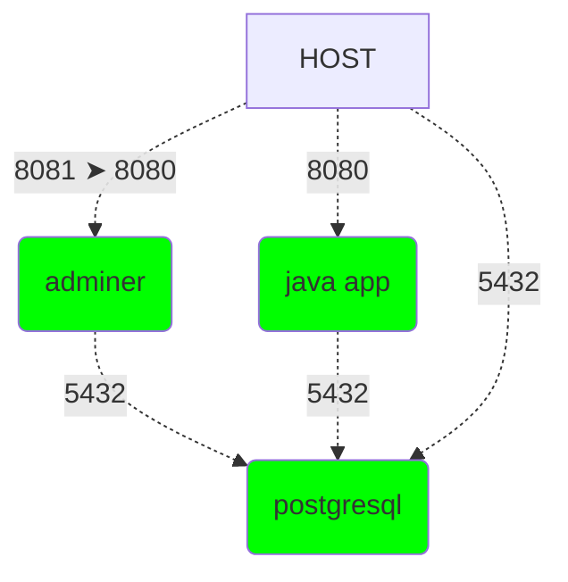

# docker-workshop

# Links utiles
- [podman](https://podman.io/) 
- [spring-graphql-2-jpa](https://github.com/Fradantim/spring-graphql-2-jpa)
- [spring-graphql-2-jpa localhost 8080](http://localhost:8080/graphiql)
- [postgresql driver](https://repo1.maven.org/maven2/org/postgresql/postgresql/42.7.3/postgresql-42.7.3.jar)

---

# Tabla de Contenidos
- [docker-workshop](#docker-workshop)
- [Links utiles](#links-utiles)
- [Tabla de Contenidos](#tabla-de-contenidos)
- [Hola mundo docker](#hola-mundo-docker)
- [Listar imagenes en mi sistema](#listar-imagenes-en-mi-sistema)
- [Creacion de imagen docker a partir de un compilado](#creacion-de-imagen-docker-a-partir-de-un-compilado)
- [Creacion de imagen docker a partir de código fuente](#creacion-de-imagen-docker-a-partir-de-código-fuente)
- [Ejecutar imagen docker](#ejecutar-imagen-docker)
  - [Exposición de puerto](#exposición-de-puerto)
- [Integracion](#integracion)
  - [Crear una red](#crear-una-red)
  - [Instanciar BBDD PostgreSQL](#instanciar-bbdd-postgresql)
  - [Instanciar adminer](#instanciar-adminer)
  - [Instanciar app con driver postgresql](#instanciar-app-con-driver-postgresql)
    - [Imagen sobrecargada](#imagen-sobrecargada)
    - [Instanciar container de imagen sobrecargada](#instanciar-container-de-imagen-sobrecargada)
  - [Diagrama](#diagrama)
  - [Apagar containers y borrar red](#apagar-containers-y-borrar-red)
  - [docker-compose](#docker-compose)


---

# Hola mundo docker

```cmd
docker run hello-world
```

# Listar imagenes en mi sistema
``` cmd
docker image ls
```
```
REPOSITORY      TAG       IMAGE ID       CREATED         SIZE
hello-world     latest    d2c94e258dcb   13 months ago   13.3kB
```

# Creacion de imagen docker a partir de un compilado
**1** Preparo la app compilada
```cmd
TODO instrucciones descarga jar
```
**2** Preparo un archivo `Dockerfile-from-compilated-src`
```Dockerfile
# a partir de esta imagen base
FROM eclipse-temurin:21.0.3_9-jre-jammy
# copiar de mi equipo los *.jar (hay uno solo) y dejarlo en el directorio de trabajo de la imagen con el nombre app.jar
COPY *.jar app.jar
# cuando inicie el container de esta imagen lanzar el siguiente comando
ENTRYPOINT ["java","-jar","app.jar"]
```

```cmd
docker build .
```
(referencia al archivo `Dockerfile`)

**Especificando Dockerfile**
```cmd
docker build -f Dockerfile-from-compilated-src .
```

**Especificando Dockerfile y tag (nombre imagen)**
```cmd
docker build -f Dockerfile-from-compilated-src -t graphql-2-jpa:from-compilated-src .
```

# Creacion de imagen docker a partir de código fuente
**1** preparo el codigo fuente
**1.a** si poseo git
```cmd
git clone https://github.com/Fradantim/spring-graphql-2-jpa.git
```
**1.b** si no poseo (mal ahi)
```cmd
curl https://github.com/Fradantim/spring-graphql-2-jpa/archive/refs/heads/main.zip
TODO instrucciones tar para extraer
```

**2** Preparo un archivo `Dockerfile-from-src`
```Dockerfile
# imagen constructora
# a partir de esta imagen base
FROM eclipse-temurin:21.0.3_9-jdk-jammy AS builder
# copiar el contenido de la carpeta con el código fuente a la imagen
COPY spring-graphql-2-jpa .
RUN sh mvnw clean package -DskipTests

# imagen final
# a partir de esta imagen base
FROM eclipse-temurin:21.0.3_9-jre-jammy
# copiar de la imagen builder el compilado y dejarlo en el directorio de trabajo de la imagen final
COPY --from=builder target/*.jar app.jar
ENTRYPOINT ["java","-jar","app.jar"]
```

```cmd
docker build -f Dockerfile-from-src -t graphql-2-jpa:from-src .
```

# Ejecutar imagen docker
```cmd
docker run graphql-2-jpa:from-compilated-src
```

## Exposición de puerto
```cmd
docker run -p 8080:8080 graphql-2-jpa:from-compilated-src
```

---

# Integracion


## Crear una red
```cmd
docker network create my-network
```
## Instanciar BBDD PostgreSQL
> info: https://hub.docker.com/_/postgres
```cmd
docker run --network my-network --name my-postgresql-container -d -p 5432:5432 -e POSTGRES_USER=postgres -e POSTGRES_PASSWORD=postgres postgres:14.1-alpine
```
## Instanciar adminer
> info: https://hub.docker.com/_/adminer
```cmd
docker run --network my-network -d -p 8081:8080 adminer:standalone
```
[adminer-frontend](http://localhost:8081)
- server: my-postgresql-container
- username: postgres
- password: postgres
- database: postgres

## Instanciar app con driver postgresql

### Imagen sobrecargada
Creo `Dockerfile-psql`

```Dockerfile
# a partir de esta imagen base
FROM graphql-2-jpa:from-src
# descargo driver postgresql
RUN wget https://repo1.maven.org/maven2/org/postgresql/postgresql/42.7.3/postgresql-42.7.3.jar
# cuando inicie el container de esta imagen lanzar el siguiente comando
ENTRYPOINT ["java","-cp","app.jar:postgresql-42.7.3.jar", "org.springframework.boot.loader.launch.PropertiesLauncher"]
```

```cmd
docker build -f Dockerfile-psql -t graphql-2-jpa:psql .
```

### Instanciar container de imagen sobrecargada
```cmd
docker run --network my-network -d -p 8080:8080 graphql-2-jpa:psql --spring.datasource.url=jdbc:postgresql://my-postgresql-container:5432/postgres --spring.datasource.username=postgres --spring.datasource.password=postgres
```

## Diagrama


## Apagar containers y borrar red
```cmd
docker container ls
```

```
CONTAINER ID   IMAGE                  COMMAND                  CREATED             STATUS             PORTS                                       NAMES
f254b48e41d6   graphql-2-jpa:psql     "java -cp app.jar:po…"   1 second ago        Up 1 second        0.0.0.0:8080->8080/tcp, :::8080->8080/tcp   beautiful_bhabha
a3ac3fdd61ac   postgres:14.1-alpine   "docker-entrypoint.s…"   13 minutes ago      Up 13 minutes      0.0.0.0:5432->5432/tcp, :::5432->5432/tcp   my-postgresql-container
5c91983a4102   adminer:standalone     "entrypoint.sh php -…"   About an hour ago   Up About an hour   0.0.0.0:8081->8080/tcp, :::8081->8080/tcp   eloquent_cartwright
```

```cmd
docker container stop beautiful_bhabha my-postgresql-container eloquent_cartwright
docker container rm beautiful_bhabha my-postgresql-container eloquent_cartwright
docker network rm my-network
```

## docker-compose
Crear archivo `docker-compose.yml`

```yml
version: '3.8'
services:
  postgresql-in-dckr-cmps:
    image: postgres:14.1-alpine
    environment:
      - POSTGRES_USER=postgres
      - POSTGRES_PASSWORD=postgres
    ports:
      - "5432:5432"
    healthcheck:
      test: ["CMD-SHELL", "pg_isready -U postgres"]
      interval: 2s
      timeout: 2s
      retries: 5
  adminer:
    image: adminer:standalone
    ports:
      - "8081:8080"
  graphql-2-jpa:
    image: graphql-2-jpa:psql
    ports:
      - "8080:8080"
    environment:
      - spring.datasource.url=jdbc:postgresql://postgresql-in-dckr-cmps:5432/postgres
      - spring.datasource.username=postgres
      - spring.datasource.password=postgres
    depends_on:
      postgresql-in-dckr-cmps:
        condition: service_healthy
```