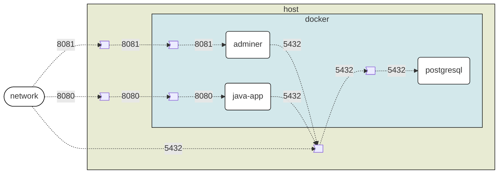
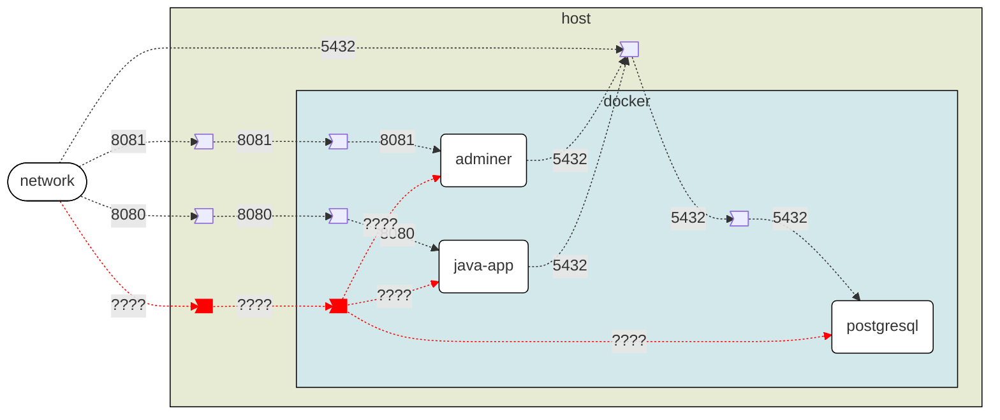
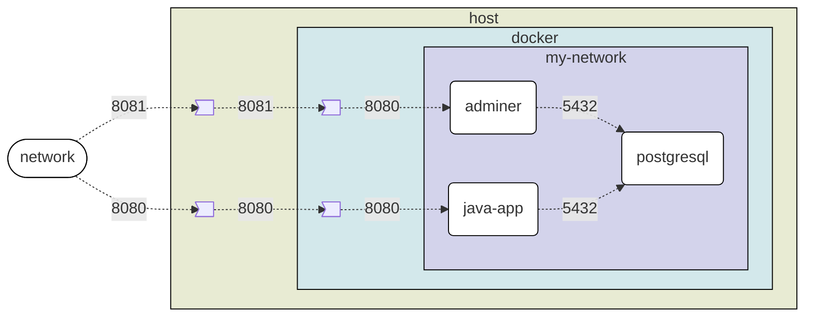

# docker-workshop

# Links utiles
- [docker](https://www.docker.com/)
- [podman](https://podman.io/)
  - Si tengo podman y no docker:
    ```
    doskey docker=podman $*
    ```
- [spring-graphql-2-jpa](https://github.com/Fradantim/spring-graphql-2-jpa)
- [spring-graphql-2-jpa localhost 8080](http://localhost:8080/graphiql)
  - graphql query:
    ```graphql
    {
      findBookById(id: 1){
        name isbn
        author { name }
        quotes { text }
      }
    }
    ```
- [postgresql driver](https://repo1.maven.org/maven2/org/postgresql/postgresql/42.7.3/postgresql-42.7.3.jar)

<details>
  <summary>docker explicado en 1 foto</summary>
  
  
  
</details>

---

# Tabla de Contenidos
- [docker-workshop](#docker-workshop)
- [Links utiles](#links-utiles)
- [Tabla de Contenidos](#tabla-de-contenidos)
- [Hola mundo docker](#hola-mundo-docker)
- [Listar imagenes en mi sistema](#listar-imagenes-en-mi-sistema)
- [Creacion de imagen docker a partir de un compilado](#creacion-de-imagen-docker-a-partir-de-un-compilado)
- [Creacion de imagen docker a partir de código fuente](#creacion-de-imagen-docker-a-partir-de-código-fuente)
- [Ejecutar imagen docker](#ejecutar-imagen-docker)
  - [Exposición de puerto](#exposición-de-puerto)
- [Ejercicios](#ejercicios)
  - [Instanciar una imagen de nyancat en la terminal](#instanciar-una-imagen-de-nyancat-en-la-terminal)
  - [Instanciar una imagen de Doom '93](#instanciar-una-imagen-de-doom-93)
- [Imagenes de Imagenes de Imagenes - Capas](#imagenes-de-imagenes-de-imagenes---capas)
- [Integracion de containers](#integracion-de-containers)
  - [Integracion entre containers via host-network](#integracion-entre-containers-via-host-network)
  - [Integracion entre containers via docker-network](#integracion-entre-containers-via-docker-network)
  - [docker-compose](#docker-compose)
- [Volumenes persistentes](#volumenes-persistentes)
  - [Storage volatil](#storage-volatil)
  - [Creacion](#creacion)
- [Montar recursos](#montar-recursos)
- [Ejemplo servlet container (Apache Tomcat, JBoss EAP, ...)](#ejemplo-servlet-container-apache-tomcat-jboss-eap-)
- [Logs de un container detachado](#logs-de-un-container-detachado)
- [Lanzar comandos shell](#lanzar-comandos-shell)
  - [En una imagen](#en-una-imagen)
  - [En  un container](#en--un-container)
- [Docker in docker](#docker-in-docker)
  - [Portainer](#portainer)
- [Pusheo a repo](#pusheo-a-repo)
- [Utiles](#utiles)
  - [Container IDE](#container-ide)
  - [Análisis de vulnerabilidades](#análisis-de-vulnerabilidades)
- [Test containers](#test-containers)
- [PRUNEO](#pruneo)


---

# Hola mundo docker

```cmd
docker run --rm hello-world
```

# Listar imagenes en mi sistema
``` cmd
docker image ls
```
```
REPOSITORY      TAG       IMAGE ID       CREATED         SIZE
hello-world     latest    d2c94e258dcb   13 months ago   13.3kB
```

# Creacion de imagen docker a partir de un compilado
Preparo un archivo `Dockerfile-from-compilated-src`
```Dockerfile
# a partir de esta imagen base
FROM eclipse-temurin:21.0.3_9-jre-jammy
# descargo el .jar de la aplicacion
ADD https://github.com/Fradantim/spring-graphql-2-jpa/releases/download/8/graphql-2-jpa-8.jar ./graphql-2-jpa.jar
# o si ya tengo el .jar en mi PC puedo:
# COPY graphql-2-jpa.jar .
# cuando inicie el container de esta imagen lanzar el siguiente comando
ENTRYPOINT ["java","-jar","graphql-2-jpa.jar"]
```

```cmd
docker build .
```
(referencia al archivo `Dockerfile`)

**Especificando Dockerfile**
```cmd
docker build -f Dockerfile-from-compilated-src .
```

**Especificando Dockerfile y tag (nombre imagen)**
```cmd
docker build -f Dockerfile-from-compilated-src -t graphql-2-jpa:from-compilated-src .
```

# Creacion de imagen docker a partir de código fuente

Descargo el código fuente
```cmd
git clone https://github.com/Fradantim/spring-graphql-2-jpa.git --branch=8
```

<details>
<summary>Plan B si no tengo git (mal ahi)</summary>

```cmd
curl -fOsSL https://github.com/Fradantim/spring-graphql-2-jpa/archive/refs/tags/8.zip
tar -xf 8.zip
del 8.zip
move spring-graphql-2-jpa-8 spring-graphql-2-jpa
```

</details>


Preparo un archivo `Dockerfile-from-src`
```Dockerfile
# "Multi stage build"
# imagen constructora
# a partir de esta imagen base
FROM eclipse-temurin:21.0.3_9-jdk-jammy AS builder
# copio el fuente
COPY spring-graphql-2-jpa .
# compilo
RUN sh mvnw clean package -DskipTests

# imagen final
# a partir de esta imagen base
FROM eclipse-temurin:21.0.3_9-jre-jammy
# copiar de la imagen builder el compilado y dejarlo en el directorio de trabajo de la imagen final
COPY --from=builder target/*.jar graphql-2-jpa.jar
ENTRYPOINT ["java","-jar","graphql-2-jpa.jar"]
```

```cmd
docker build -f Dockerfile-from-src -t graphql-2-jpa:from-src .
```

# Ejecutar imagen docker
```cmd
docker run --rm graphql-2-jpa:from-src
```

## Exposición de puerto
```cmd
docker run --rm -p 8080:8080 graphql-2-jpa:from-src
```

# Ejercicios

## Instanciar una imagen de nyancat en la terminal

[Pista](https://hub.docker.com/r/06kellyjac/nyancat)

## Instanciar una imagen de Doom '93

[Pista](https://hub.docker.com/r/kasmweb/doom)

---

# Imagenes de Imagenes de Imagenes - Capas

Creo `Dockerfile-psql`

```Dockerfile
# a partir de esta imagen base
FROM graphql-2-jpa:from-src
# descargo driver postgresql
ADD https://repo1.maven.org/maven2/org/postgresql/postgresql/42.7.3/postgresql-42.7.3.jar .
# cuando inicie el container de esta imagen lanzar el siguiente comando
ENTRYPOINT ["java","-cp","graphql-2-jpa.jar:postgresql-42.7.3.jar", "org.springframework.boot.loader.launch.PropertiesLauncher"]
```

```cmd
docker build -f Dockerfile-psql -t graphql-2-jpa:psql .
```

eclipse-temurin:21.0.3_9-jre-jammy -> graphql-2-jpa:from-src -> graphql-2-jpa:psql

```cmd
docker history graphql-2-jpa:psql
```

<table><colgroup width="85"></colgroup><colgroup width="382"></colgroup><colgroup width="85"></colgroup><colgroup width="382"></colgroup><tbody><tr><td></td><td><strong>IMAGEN</strong></td><td><strong>graphql-2-jpa:psql</strong></td><td></td><td></td></tr><tr><td>18</td><td>0B</td><td>ENTRYPOINT ["java" "-cp" "graphql-2-jpa.jar:…</td><td></td><td></td></tr><tr><td>17</td><td>1.09MB</td><td>ADD https://repo1.maven.org/maven2/org/postg…</td><td></td><td></td></tr><tr><td></td><td><strong>IMAGEN</strong></td><td><strong>graphql-2-jpa:from-src</strong></td><td></td><td></td></tr><tr><td>16</td><td>0B</td><td>ENTRYPOINT ["java" "-jar" "graphql-2-jpa.jar"]</td><td></td><td></td></tr><tr><td>15</td><td>53MB</td><td>COPY target/*.jar graphql-2-jpa.jar # buildkit</td><td></td><td></td></tr><tr><td></td><td><strong>IMAGEN</strong></td><td><strong><a href="https://hub.docker.com/layers/library/eclipse-temurin/21.0.3_9-jre-jammy/images/sha256-3186dd88a59659929855a6bb785b0528c812eb0b03d97fd6e2221526547ed322?context=explore">eclipse-temurin:21.0.3_9-jre-jammy</a></strong></td><td><strong>IMAGEN</strong></td><td><strong><a href="https://hub.docker.com/layers/library/eclipse-temurin/21.0.3_9-jdk-jammy/images/sha256-7291a4337ec7942c77490d4e44db3ec6d46cbef038b76108cec3949c0c06e550?context=explore">eclipse-temurin:21.0.3_9-jdk-jammy</a></strong></td></tr><tr><td>15</td><td></td><td></td><td>0B</td><td>CMD ["jshell"]</td></tr><tr><td>14</td><td>0B</td><td>ENTRYPOINT ["/__cacert_entrypoint.sh"]</td><td>0B</td><td>ENTRYPOINT ["/__cacert_entrypoint.sh"]</td></tr><tr><td>13</td><td>1.18kB</td><td>COPY entrypoint.sh /__cacert_entrypoint.sh #…</td><td>1.18kB</td><td>COPY entrypoint.sh /__cacert_entrypoint.sh #…</td></tr><tr><td>12</td><td>0B</td><td>RUN /bin/sh -c set -eux; echo "Verifying…</td><td>0B</td><td>RUN /bin/sh -c set -eux; echo "Verifying…</td></tr><tr><td>11</td><td>165MB</td><td>RUN /bin/sh -c set -eux; ARCH="$(dpkg --…</td><td>308MB</td><td>RUN /bin/sh -c set -eux; ARCH="$(dpkg --…</td></tr><tr><td>10</td><td>0B</td><td>ENV JAVA_VERSION=jdk-21.0.3+9</td><td>0B</td><td>ENV JAVA_VERSION=jdk-21.0.3+9</td></tr><tr><td>9</td><td>36.1MB</td><td>RUN /bin/sh -c set -eux; apt-get update;…</td><td>50MB</td><td>RUN /bin/sh -c set -eux; apt-get update;…</td></tr><tr><td>8</td><td>0B</td><td colspan="3">ENV LANG=en_US.UTF-8 LANGUAGE=en_US:en LC_AL…</td></tr><tr><td>7</td><td>0B</td><td colspan="3">ENV PATH=/opt/java/openjdk/bin:/usr/local/sb…</td></tr><tr><td>6</td><td>0B</td><td colspan="3">ENV JAVA_HOME=/opt/java/openjdk</td></tr><tr><td>5</td><td>0B</td><td colspan="3">/bin/sh -c #(nop) CMD ["/bin/bash"]</td></tr><tr><td>4</td><td>77.9MB</td><td colspan="3">/bin/sh -c #(nop) ADD file:89847d76d242dea90…</td></tr><tr><td>3</td><td>0B</td><td colspan="3">/bin/sh -c #(nop) LABEL org.opencontainers.…</td></tr><tr><td>2</td><td>0B</td><td colspan="3">/bin/sh -c #(nop) LABEL org.opencontainers.…</td></tr><tr><td>1</td><td>0B</td><td colspan="3">/bin/sh -c #(nop) ARG LAUNCHPAD_BUILD_ARCH</td></tr><tr><td>0</td><td>0B</td><td colspan="3">/bin/sh -c #(nop) ARG RELEASE</td></tr></tbody></table>

# Integracion de containers

## Integracion entre containers via host-network

**Instancio bbdd postgresql**
> info: https://hub.docker.com/_/postgres
```cmd
docker run -d --rm --name my-postgresql-container --net=host -e POSTGRES_USER=postgres -e POSTGRES_PASSWORD=postgres postgres:14.1-alpine
```

**Instancio mi app que se conecta a la bbdd**
```cmd
docker run -d --rm --name my-app --net=host graphql-2-jpa:psql --spring.datasource.url=jdbc:postgresql://localhost:5432/postgres --spring.datasource.username=postgres --spring.datasource.password=postgres
```

**Instancio adminer que se conecta a la bbdd**
> info: https://hub.docker.com/_/adminer
```cmd
docker run -d --rm --name adminer --net=host adminer:standalone php -S [::]:8081 -t /var/www/html
```

[adminer](http://localhost:8081)

- server: localhost
- username: postgres
- password: postgres
- database: postgres



<details>
<summary>Lo que no se ve</summary>



</details>

**Detener todo**
```cmd
docker container ls
```

```
CONTAINER ID  IMAGE                                   COMMAND               CREATED         STATUS         PORTS       NAMES
ffc27ecd0854  docker.io/library/postgres:14.1-alpine  postgres              44 minutes ago  Up 44 minutes              my-postgresql-container
2dea23aa174c  localhost/graphql-2-jpa:psql            --spring.datasour...  43 minutes ago  Up 43 minutes              my-app
74352566dc25  docker.io/library/adminer:standalone    php -S [::]:8081 ...  36 minutes ago  Up 36 minutes              adminer
```

```cmd
docker container stop my-app adminer my-postgresql-container
```

## Integracion entre containers via docker-network

**Instancio mi red privada**
```
docker network create my-network
```

**Instancio bbdd postgresql**
> info: https://hub.docker.com/_/postgres
```cmd
docker run -d --rm --network my-network --name my-postgresql-container -e POSTGRES_USER=postgres -e POSTGRES_PASSWORD=postgres postgres:14.1-alpine
```

**Instancio mi app que se conecta a la bbdd**
```cmd
docker run -d --rm --network my-network --name my-app -p 8080:8080 graphql-2-jpa:psql --spring.datasource.url=jdbc:postgresql://my-postgresql-container:5432/postgres --spring.datasource.username=postgres --spring.datasource.password=postgres
```

**Instancio adminer que se conecta a la bbdd**
> info: https://hub.docker.com/_/adminer
```cmd
docker run -d --rm --network my-network --name adminer -p 8081:8080 adminer:standalone
```

[adminer](http://localhost:8081)

- server: my-postgresql-container
- username: postgres
- password: postgres
- database: postgres


**Detener todo**
```cmd
docker container ls
```

```
CONTAINER ID  IMAGE                                   COMMAND               CREATED         STATUS         PORTS                   NAMES
c73a5bfe8c26  docker.io/library/postgres:14.1-alpine  postgres              16 seconds ago  Up 16 seconds                          my-postgresql-container
937c395d3adc  localhost/graphql-2-jpa:psql            --spring.datasour...  12 seconds ago  Up 12 seconds  0.0.0.0:8080->8080/tcp  my-app
67de36ef7d42  docker.io/library/adminer:standalone    php -S [::]:8080 ...  8 seconds ago   Up 8 seconds   0.0.0.0:8081->8080/tcp  adminer
```

```cmd
docker container stop my-app adminer my-postgresql-container
docker network rm my-network
```




## docker-compose
[podman setting up compose](https://podman-desktop.io/docs/compose/setting-up-compose)

Crear archivo `docker-compose.yml`

```yml
version: '3.8'
services:
  postgresql-in-dckr-cmps:
    image: postgres:14.1-alpine
    environment:
      - POSTGRES_USER=postgres
      - POSTGRES_PASSWORD=postgres
    healthcheck:
      test: ["CMD-SHELL", "pg_isready -U postgres"]
      interval: 2s
      timeout: 2s
      retries: 5
  adminer:
    image: adminer:standalone
    ports:
      - "8081:8080"
  graphql-2-jpa:
    image: graphql-2-jpa:psql
    ports:
      - "8080:8080"
    environment:
      - spring.datasource.url=jdbc:postgresql://postgresql-in-dckr-cmps:5432/postgres
      - spring.datasource.username=postgres
      - spring.datasource.password=postgres
    depends_on:
      postgresql-in-dckr-cmps:
        condition: service_healthy
```

```cmd
docker compose up
```

# Volumenes persistentes

## Storage volatil
```cmd
docker run --rm -it --entrypoint bash eclipse-temurin:21.0.3_9-jre-jammy
```
```bash
mkdir /my-directory
cd /my-directory/
echo the file content  > my-file.txt
ls
cat my-file.txt 
exit
```

Mato container, lo re-creo y busco mis archivos creados
```cmd
docker run --rm -it --entrypoint bash eclipse-temurin:21.0.3_9-jre-jammy
```
```bash
cd /my-directory/
```
que pasó?


## Creacion
```cmd
docker volume create my-volume
docker run --rm -it --entrypoint bash -v my-volume:/my-directory eclipse-temurin:21.0.3_9-jre-jammy
```
```bash
cd /my-directory/
echo the file content  > my-file.txt
ls
cat my-file.txt 
exit
```

Mato container, lo re-creo y busco mis archivos creados
```cmd
docker run --rm -it --entrypoint bash -v my-volume:/my-directory eclipse-temurin:21.0.3_9-jre-jammy
```
```bash
cd /my-directory/
ls my-file.txt 
cat 
```

# Montar recursos
Creemos un archivo `test.py`

```python
import time, platform
from datetime import datetime

required_version = '3.12.4'
current_version  = platform.python_version()

if current_version != required_version:
    raise Exception(f'Must be using Python {required_version}, but found {current_version}')

while True:
  print(datetime.now())
  time.sleep(1) # sleep 1 second
```

```cmd
docker run --rm -it -v .:/app-src python:3.12.4-alpine3.20 python /app-src/test.py
```
*En este comando refuerzo -it "interactive" para que la salida de texto a terminal sea instantánea. ¿Cosa rara de la imagen de python en alpine?*


# Ejemplo servlet container (Apache Tomcat, JBoss EAP, ...)

Descargo el archivo .war (o lo proveo si tengo uno)
```cmd
curl -fOsSL  https://github.com/Fradantim/spring-graphql-2-jpa/releases/download/8/graphql-2-jpa-8.war
```

Creo el archivo `docker-compose-servlet-container.yml`:

```yml
services:
  setvlet-container:
    image: tomcat:10-jre17 # tomcat
    # image: quay.io/wildfly/wildfly:27.0.0.Final-jdk17 # jboss wildfly
    volumes:
      - ./graphql-2-jpa-8.war:/usr/local/tomcat/webapps/graphql-2-jpa.war:ro # para tomcat
      # - ./graphql-2-jpa-8.war:/opt/jboss/wildfly/standalone/deployments/graphql-2-jpa.war:ro # para jboss wildfly
    ports:
      - 8080:8080
```

[graphiql](http://localhost:8080/graphql-2-jpa/graphiql?path=/graphql-2-jpa/graphql)


# Logs de un container detachado

Inicio contianer detachado
```cmd
docker run --rm -it -d --name my-python-container -v .:/app-src python:3.12.4-alpine3.20 python /app-src/test.py
```

```cmd
docker container ls
```

```
CONTAINER ID   IMAGE                      COMMAND                  CREATED         STATUS         PORTS     NAMES
7c82626c2c77   python:3.12.4-alpine3.20   "python /app-src/tes…"   4 seconds ago   Up 3 seconds             my-python-container
```

```cmd
docker logs --follow my-python-container
```
```cmd
docker logs --follow --tail 1 my-python-container 
```

Detener el container
```cmd
docker container stop my-python-container
```

# Lanzar comandos shell

## En una imagen
```cmd
docker run --rm -it --entrypoint bash graphql-2-jpa:from-src
```

## En  un container
**Java - Debian (bash)**
```cmd
docker run -d --rm --name my-java-container graphql-2-jpa:from-src
```
```cmd
docker exec -it my-java-container bash
```

**Python - Alpine (ash)**
```cmd
docker run --rm -it -d --name my-python-container -v .:/app-src python:3.12.4-alpine3.20 python /app-src/test.py
```
```cmd
docker exec -it my-python-container ash
```

Detener todo
```cmd
docker container stop my-java-container my-python-container
```

# Docker in docker

```cmd
docker run --rm -d --privileged --name dind docker:dind
docker exec dind docker run alpine echo hello
docker stop dind
```

```cmd
podman run --rm --user podman --device /dev/fuse quay.io/podman/stable podman run alpine echo hello
```

## Portainer

[portainer.io](https://www.portainer.io/)
[local portainer](http://www.localhost:9000)

Ubicar docker entrypoint
```cmd
docker context ls
```

**Docker**
```
NAME         DESCRIPTION                               DOCKER ENDPOINT                     ERROR
default      Current DOCKER_HOST based configuration   unix:///var/run/docker.sock         
rootless *   Rootless mode                             unix:///run/user/1000/docker.sock   
```

```cmd
docker run --rm -p 9000:9000 -v /run/user/1000/docker.sock:/var/run/docker.sock portainer/portainer-ce:latest
```

**Podman**
```
Name                         URI                                                          Identity                                                                  Default     ReadWrite
podman-machine-default       ssh://user@127.0.0.1:59462/run/user/1000/podman/podman.sock  C:\Users\franco.d.timpone\.local\share\containers\podman\machine\machine  false       true
podman-machine-default-root  ssh://root@127.0.0.1:59462/run/podman/podman.sock            C:\Users\franco.d.timpone\.local\share\containers\podman\machine\machine  true        true
```

```cmd
docker run --rm -p 9000:9000 -v /run/podman/podman.sock:/var/run/docker.sock portainer/portainer-ce:latest
```

# Pusheo a repo
[docker registry image](https://hub.docker.com/_/registry)

Iniciar container registry
```cmd
docker run --rm -d -p 5000:5000 --name registry registry
```

Creemos una nueva tag en nuestro local y la pusheamos al registry

```cmd
docker tag graphql-2-jpa:from-src localhost:5000/graphql-2-jpa:from-src
docker push localhost:5000/graphql-2-jpa:from-src
```

[Info de la imagen en registry](http://localhost:5000/v2/graphql-2-jpa/tags/list)

Creemos otra tag más para la misma imagen en nuestro local y la pusheamos al registry
```cmd
docker tag graphql-2-jpa:psql localhost:5000/graphql-2-jpa:psql
docker push localhost:5000/graphql-2-jpa:psql
```

Borro ambas tags de mi local (y todas las imagenes que puedan compartir las mismas capas)
```cmd
docker image rm eclipse-temurin:21.0.3_9-jre-jammy eclipse-temurin:21.0.3_9-jdk-jammy graphql-2-jpa:psql localhost:5000/graphql-2-jpa:from-src graphql-2-jpa:from-src localhost:5000/graphql-2-jpa:psql
```

Las vuelvo a descargar de el registry
```cmd
docker pull localhost:5000/graphql-2-jpa:from-src
docker pull localhost:5000/graphql-2-jpa:psql
```

```cmd
docker image ls
```

Detener container registry
```cmd
docker container registry stop
```

# Utiles

## Container IDE

<details>
<summary>The docker way (no podman)</summary>

Creemos `docker-compose-web-ide.yml`

```yml
services:
  web-ide:
    build:
      context: .
      dockerfile_inline: |
        FROM codercom/code-server:4.90.3-ubuntu
        # descargo e instalo JDK 21 ~188MB
        ADD https://download.oracle.com/java/21/archive/jdk-21.0.2_linux-x64_bin.tar.gz .
        USER root
        RUN tar -xvzf jdk-21.0.2_linux-x64_bin.tar.gz
        RUN rm jdk-21.0.2_linux-x64_bin.tar.gz
        RUN mv jdk-21.0.2 /
        RUN chmod --recursive +rx /jdk-21.0.2
        USER coder
        ENV JAVA_HOME=/jdk-21.0.2
        # instalo extensiones de java para vs code
        RUN code-server --install-extension redhat.java
        RUN code-server --install-extension vscjava.vscode-java-debug

        # instalo docker (https://docs.docker.com/engine/install/ubuntu/)
        RUN curl -fsSL https://get.docker.com -o get-docker.sh
        RUN sudo sh ./get-docker.sh

        # ejecutar docker como non-root (https://docs.docker.com/engine/install/linux-postinstall/)
        # RUN sudo groupadd docker
        RUN sudo usermod -aG docker coder
        RUN newgrp docker

        # instalo el codigo fuente sobre el que voy a trabajar (podria montarlo con un volumen)
        RUN git clone https://github.com/Fradantim/spring-graphql-2-jpa.git
    command: --auth none
    ports:
      - "8080:8080"
    volumes:
      # docker in docker
      - /run/user/1000/docker.sock:/var/run/docker.sock # unix
      - "~/.m2/repository:/home/coder/.m2/repository"
```

> Building 139.6s (18/18)

</details>

[containers/podman-compose Support for dockerfile_inline missing](https://github.com/containers/podman-compose/issues/864)

Creemos `Dockerfile-web-ide`

```Dockerfile
FROM codercom/code-server:4.90.3-ubuntu

# descargo e instalo JDK 21 ~188MB
RUN wget https://download.oracle.com/java/21/archive/jdk-21.0.2_linux-x64_bin.tar.gz \
    && tar -xzf jdk-21.0.2_linux-x64_bin.tar.gz \
    && rm jdk-21.0.2_linux-x64_bin.tar.gz \
    && mkdir -p /home/coder/java \
    && mv jdk-21.0.2 /home/coder/java/jdk-21.0.2
ENV JAVA_HOME=/home/coder/java/jdk-21.0.2
ENV PATH="$PATH:$JAVA_HOME/bin"

# Ayuda a que no choque el directorio con el mount mas adelante
RUN mkdir .m2

# instalo extensiones de java para vs code
RUN code-server --install-extension redhat.java \
   && code-server --install-extension vscjava.vscode-java-debug \
   && code-server --install-extension vscjava.vscode-java-test

# instalo cliente docker (https://docs.docker.com/engine/install/ubuntu/#install-from-a-package)
RUN wget https://download.docker.com/linux/ubuntu/dists/focal/pool/stable/amd64/docker-ce-cli_27.1.1-1~ubuntu.20.04~focal_amd64.deb \
    && wget https://download.docker.com/linux/ubuntu/dists/focal/pool/stable/amd64/docker-compose-plugin_2.29.1-1~ubuntu.20.04~focal_amd64.deb \
    && sudo dpkg -i docker-ce-cli_27.1.1-1~ubuntu.20.04~focal_amd64.deb docker-compose-plugin_2.29.1-1~ubuntu.20.04~focal_amd64.deb \
    && rm docker-ce-cli_27.1.1-1~ubuntu.20.04~focal_amd64.deb docker-compose-plugin_2.29.1-1~ubuntu.20.04~focal_amd64.deb
```

Creemos `docker-compose-web-ide.yml`

```yml
services:
  web-ide:
    build:
      context: .
      dockerfile: Dockerfile-web-ide
    command: --auth none
    ports:
      - "8080:8080"
    environment:
      - DOCKER_HOST=tcp://dind:2375
    volumes:
      # opcional, librerias de mvn 
      - ~/.m2/repository:/home/coder/.m2/repository
      - ./spring-graphql-2-jpa:/home/coder/spring-graphql-2-jpa
      - ./test-containers-example:/home/coder/test-containers-example
  dind:
    image: docker:18.09.9-dind
    privileged: true
```

```cmd
docker compose -f docker-compose-web-ide.yml up
```

[vscode-container](http://localhost:8080/?folder=/home/coder/spring-graphql-2-jpa)

[vscode-container graphiql](http://localhost:8080/proxy/8081/graphiql?path=/proxy/8081/graphql)

## Análisis de vulnerabilidades

```cmd
mkdir aquasec-trivy-cache
docker run -v ./aquasec-trivy-cache:/root/.cache/ -v /run/podman/podman.sock:/var/run/docker.sock aquasec/trivy image graphql-2-jpa:from-compilated-src
```

# Test containers

[Spring Tips: Testcontainers, Docker Compose, and Service Connections, oh my!](https://www.youtube.com/watch?v=msb2b3BeeQo&ab_channel=SpringDeveloper)
[](https://www.youtube.com/watch?v=msb2b3BeeQo&ab_channel=SpringDeveloper)

# PRUNEO

```cmd
docker container prune -a
docker image prune -a
docker volume prune -a
docker builder prune -a
```


TODO Ejercicio PHP / NodeJS / Kafka
