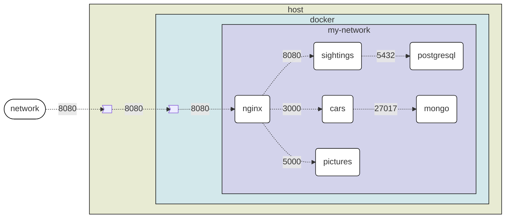

# docker exam

Create a single `docker-compose.yml` (or list of sequenced commands) to deploy the next solution:

The nginx configuration and `docker-compose.yml` information is provided, but `postgresql`, `mongo`, the java `sightings` app, the node js `cars` app, and the python `pictures` app must be provided as containers.

Make sure to include all environmental variables, healthchecks and containers dependencies (initialization order) so all containers start correctly.

Building and starting all 6 containers at the time may be difficult, a recommendation:

1. Start only the `pictures`, make sure it starts ok (does not end process).
2. Start both `pictures` and `postgresql`, make sure they all start ok.
3. Start all `pictures`, `postgresql` and `mongo`, make sure they all start ok.
4. Start all `pictures`, `postgresql`, `mongo` and `sightings`
   1. Make sure to start `sightings` only when `postgresql` is ready to accept new connections. (`sightings` will stop if connection cant be done)
   2. Make sure they all start ok.
5. Start all `pictures`, `postgresql`, `mongo`, `sightings` and `cars`
   1. Make sure to start `sightings` only when `postgresql` is ready to accept new connections. (`sightings` will stop if connection cant be done)
   2. Make sure to start `cars` only when `mongo` is ready to accept new connections. (`cars` will stop if connection cant be done)
   3. Make sure they all start ok.
6. Start all `pictures`, `postgresql`, `mongo`, `sightings`, `cars` and `web`
   1. Make sure to start `sightings` only when `postgresql` is ready to accept new connections. (`sightings` will stop if connection cant be done)
   2. Make sure to start `cars` only when `mongo` is ready to accept new connections. (`cars` will stop if connection cant be done)
   3. Make sure to start `web` only when `pictures`, `sightings` and `cars` are ready to accept new connections. (`web` wont start otherwise)
   4. Make sure they all start ok.

Once all containers are running attach to cars and call the `seed` endpoint to fill the Mongo database.

On [localhost:8080](http://localhost:8008) you should see a frontend where you can upload images and input car sightings:

